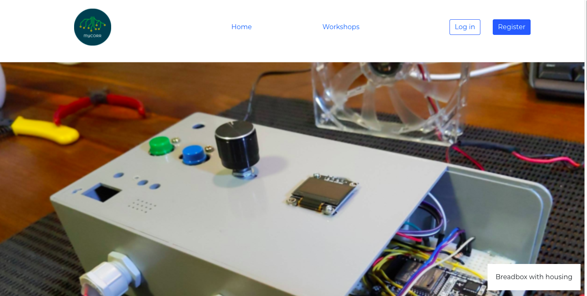

# Mycorr website

This is a fake business website for the purposes of learning the MERN (MongoDB, Express, React, Node) stack. This business website simulates a company that does online remote STEM training for coding and electronics.

There are only two pages at the moment, the Home page and Workshops page. The Workshops page lists the STEM workshops that the user can "register" for. The user needs to create a login profile first before being allowed to register.

This project is broken down into two parts:

- Front-end: React [Github repo](https://github.com/lthben/mycorr-react-app.git)
  - renders the website with React components, uses useState and useEffect hooks
  - calls on the backend data using inbuilt browser fetch command
- Back-end: Express, Node, MongoDB [Github repo](https://github.com/lthben/mycorr-express-app.git)
  - CRUD functions to update MongoDB with data using Mongoose
  - all the API logic handled here and returns a response to frontend for all fetch requests

## Live link

http://mycorrsg.com
